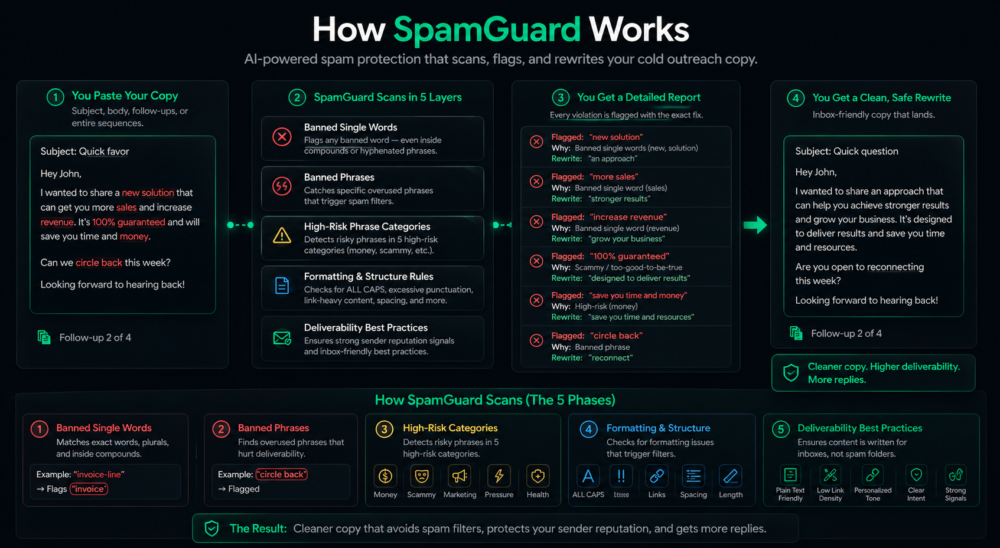
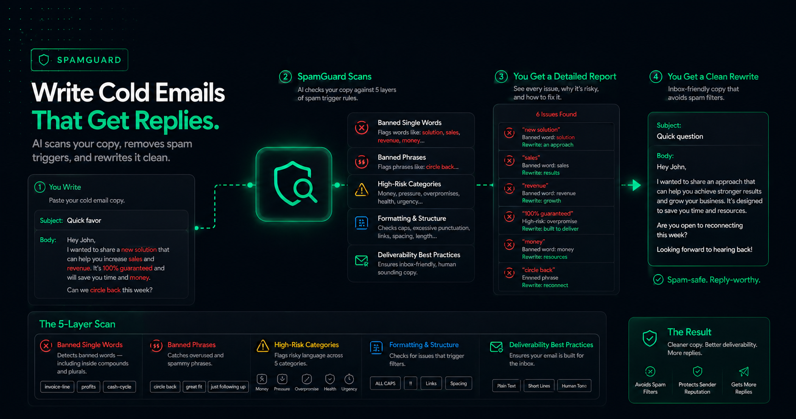

<div align="center">


<br/><br/>

[](./LICENSE)
[](https://claude.ai/code)
[](https://github.com/termsheetinator)

<br/>

*Brought to you by [InfraSuite](https://infrasuite.io) and Advisory Incubator™*

</div>

---

## What This Is

A Claude Code skill that scans cold email copy against a comprehensive deliverability ruleset — flags every violation, rewrites every flagged line in plain English, then runs the clean version through an internal audit loop until it passes with zero violations before it reaches you.

Paste any copy: subject lines, email bodies, follow-up sequences, CTAs, opener lines, LinkedIn DMs, or any custom variable.

No setup. No memory file. Paste and scan.

---

## What It Covers

```
SPAMGUARD COVERAGE
━━━━━━━━━━━━━━━━━━━━━━━━━━━━━━━━━━━━━━━━━━━━━━━━━━━━━

  300+  banned single words
         — including compound and hyphenated forms
         — lower-cost, no-cost, interest-free, money-back
         — plurals of banned words are also banned
         — detection: whole-word AND substring match

    7   high-risk phrase categories
         → Money & financial hype
         → Scammy / too-good-to-be-true language
         → Marketing overpromises
         → Pressure & clickbait
         → Health & pharma terms
         → Tech phishing-like phrases
         → Gambling, adult & blacklisted terms

   26   banned follow-up phrases
         — clichés that signal a template instantly

    1   internal audit loop
         — clean version re-scanned before delivery
         — rewrites until zero violations, then stops
         — audit pass count shown in output

    5   formatting checks
         → ALL CAPS anywhere in subject or body
         → Em dashes (—) — the AI giveaway
         → Multiple exclamation marks
         → Excessive links
         → Promotional formatting

━━━━━━━━━━━━━━━━━━━━━━━━━━━━━━━━━━━━━━━━━━━━━━━━━━━━━

Works on:
  emails · subject lines · follow-up sequences
  CTAs · opener lines · LinkedIn DMs · custom variables
```

---

## How It Works

<div align="center">

</div>

---

## Output Format

Every scan returns the same structure — clean, readable, actionable:

```
━━━━━━━━━━━━━━━━━━━━━━━━━━━━━━━━━━━━━━━━━━━━━━━
  SPAMGUARD SCAN
━━━━━━━━━━━━━━━━━━━━━━━━━━━━━━━━━━━━━━━━━━━━━━━

  Total violations: [n]

  ── Banned single words ──────────────────────
  "[exact token in context]"
    → word:    [banned word]
    → rewrite: [plain rewrite of the line]

  ── Banned phrases ───────────────────────────
  "[exact phrase]"
    → rewrite: [plain rewrite]

  ── High-risk phrases ────────────────────────
  "[exact phrase]"
    → category: [name]
    → rewrite:  [fix]

  ── Formatting ───────────────────────────────
  [flag] → [what to do]

━━━━━━━━━━━━━━━━━━━━━━━━━━━━━━━━━━━━━━━━━━━━━━━
  CLEAN VERSION
  Internal audit: [n] pass(es) — zero violations confirmed
━━━━━━━━━━━━━━━━━━━━━━━━━━━━━━━━━━━━━━━━━━━━━━━

  [Full rewrite — every violation resolved,
   audited clean before delivery]

━━━━━━━━━━━━━━━━━━━━━━━━━━━━━━━━━━━━━━━━━━━━━━━
  VERDICT
━━━━━━━━━━━━━━━━━━━━━━━━━━━━━━━━━━━━━━━━━━━━━━━

  [One sentence: violations found, audit passes,
   send-ready confirmation]
```

---

## The Rewrite Principle

SpamGuard does not swap words. It rewrites lines from the idea underneath them.

```
WHAT IT DOES
━━━━━━━━━━━━━━━━━━━━━━━━━━━━━━━━━━━━━━━━━━━━━━━

  1. Read the flagged line
  2. Identify what it's actually trying to say
  3. Write that in plain English — grade 5 level
  4. Check every word in the rewrite against
     the banned list before committing
  5. If anything hits — rewrite the whole
     line again from scratch

━━━━━━━━━━━━━━━━━━━━━━━━━━━━━━━━━━━━━━━━━━━━━━━

  Replace  →  promotional language   with  observational
  Replace  →  pressure               with  permission
  Replace  →  hype                   with  specificity

  If it sounds like an ad, a scam, or a coupon
  — rewrite it.
```

---

<div align="center">

</div>

---

## Install

```bash
curl -fsSL https://raw.githubusercontent.com/termsheetinator/spamguard-cold-email/main/install.sh | bash
```

Open [Claude Code](https://claude.ai/code) in any directory and run:

```
/spamguard
```

Paste your copy. Get a clean scan.

---

## Also Included In

SpamGuard ships as part of **[Proximity Cold Email](https://github.com/termsheetinator/proximity-cold-email)** — the full cold email writing and auditing toolkit. Install that if you want both the Proximity Method writer and SpamGuard together.

---

## Files

| File | Purpose |
|---|---|
| `spamguard.md` | The Claude Code skill — installs to `~/.claude/skills/` |
| `spamwords.md` | Master spam word and phrase reference — installed to your project directory |
| `install.sh` | One-command installer |

---

## Requirements

- [Claude Code](https://claude.ai/code) — the CLI for Claude
- An [Anthropic](https://anthropic.com) account

---

<div align="center">

---

**Brought to you by**

[**InfraSuite**](https://infrasuite.io) — Enterprise Grade Cold-Email Mailboxes

**×**

**Advisory Incubator™** — AI & Tech Enabled Advisory

<br/>

*Written and maintained by [Termsheetinator](https://github.com/termsheetinator)*

<br/>

© 2026 Termsheetinator. All rights reserved. — [License](./LICENSE)

</div>
